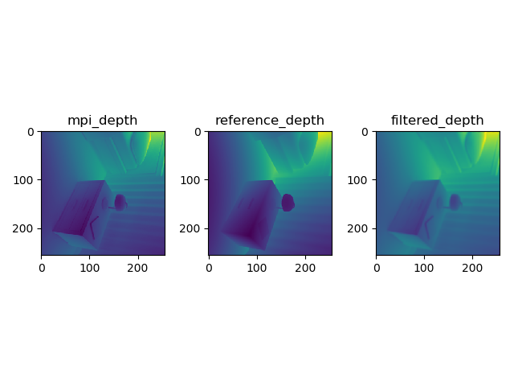

# Time-of-flight
a simple encoder-decoder network used to filter raw tof depth
The neetwork was trained on the dataset provided by
    DeepToF: Off-the-Shelf Real-Time Correction of Multipath Interference in Time-of-Flight Imaging
    Julio Marco, Quercus Hernandez, Adolfo Muñoz, Yue Dong, Adrian Jarabo, Min H. Kim, Xin Tong, Diego Gutierrez
    ACM Transactions on Graphics, Vol.36(6)

For more details on the data generation please refer to the full paper:http://webdiis.unizar.es/~juliom/pubs/2017SIGA-DeepToF/

And you can download the whole dataset from above link.
First, run tfrecords.py to generate train.tfrecords and test.tfrecords. To generate test.tfrecords, you should do a little 
change to tfrecords.py.
Then, run tof_train.py and tof_eval.py to get the result.
Here are two results:

